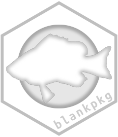

<!-- README.md is generated from README.Rmd. Please edit that file -->

```{r, include = FALSE}
knitr::opts_chunk$set(
  collapse = TRUE,
  comment = "#>",
  fig.path = "man/figures/README-",
  out.width = "100%"
)
```

# blankpkg 

<!-- badges: start -->
[](https://github.com/k-hench/blankpkg/actions)
[](https://codecov.io/gh/k-hench/blankpkg?branch=master)
[](https://lifecycle.r-lib.org/articles/stages.html#experimental)
<!-- badges: end -->

The goal of blankpkg is to ...

## Installation

You can install the released version of blankpkg from [github](https://github.com/k-hench/blankpkg) with:

``` r
install.packages("remotes")
remotes::install_github("k-hench/blankpkg")
```

## Example

This is a basic example which shows you how to solve a common problem:

```{r example}
library(blankpkg)
## basic example code
blank_x()
```

What is special about using `README.Rmd` instead of just `README.md`? You can include R chunks like so:

```{r cars}
summary(cars)
```

You'll still need to render `README.Rmd` regularly, to keep `README.md` up-to-date. `devtools::build_readme()` is handy for this. You could also use GitHub Actions to re-render `README.Rmd` every time you push. An example workflow can be found here: <https://github.com/r-lib/actions/tree/master/examples>.

You can also embed plots, for example:

```{r pressure, echo = FALSE, fig.asp = .6, dev.args = list(type = "cairo")}
plot(pressure)
```

In that case, don't forget to commit and push the resulting figure files, so they display on GitHub and CRAN.
